  <h3><i>Where maths meets code.</i></h3>
  
  

    
    
    
  

---

## 👨‍💻 About Me

I am a student pursuing a double degree in **Mathematics and Computer Engineering** at **Universidad Rey Juan Carlos (URJC)**. I'm passionate about bridging mathematical theory with practical, intelligent software.

- 🎓 Expected graduation: **2028**.
- 💡 Focused on: **Software Engineering, Data Science, and Machine Learning**.
- 🎯 Currently looking for internships and open to collaborations.

---

## 🛠️ Tech Stack & Knowledge

**Languages**

  
   &nbsp;&nbsp;&nbsp;
  
  
   &nbsp;&nbsp;&nbsp;
  
  
   &nbsp;&nbsp;&nbsp;
  
  
   &nbsp;&nbsp;&nbsp;
  
  
   &nbsp;&nbsp;&nbsp;
  
  
   &nbsp;&nbsp;&nbsp;
  
  
   &nbsp;&nbsp;&nbsp;
  
  
  

 

**Frameworks, Tools & Data**

  
   &nbsp;&nbsp;&nbsp;
  
  
   &nbsp;&nbsp;&nbsp;
  
  
   &nbsp;&nbsp;&nbsp;
  
  
   &nbsp;&nbsp;&nbsp;
  
  
   &nbsp;&nbsp;&nbsp;
  
  
   &nbsp;&nbsp;&nbsp;
  
  
   &nbsp;&nbsp;&nbsp;
  
  
  
  
     
  
  
   &nbsp;&nbsp;&nbsp;
  
  
   &nbsp;&nbsp;&nbsp;
  
  
   &nbsp;&nbsp;&nbsp;
 <!-- 
  
   &nbsp;&nbsp;&nbsp;
  -->
  
   &nbsp;&nbsp;&nbsp;
  
  
  

---

## 🚀 Key Projects

| Project | Description | Stack |
| :--- | :--- | :--- |
| **minishell** | Full bash-like UNIX command interpreter built in C. | `C` `Linux` |
| **mqm-app** | Microservices-based second-hand e-commerce platform. | `Java` `Spring` `Docker` |
| **data-projects** | Exploratory data analysis on Spanish Ministry of Education datasets. | `Python` `Pandas` |

---

## 📊 Overview

  

